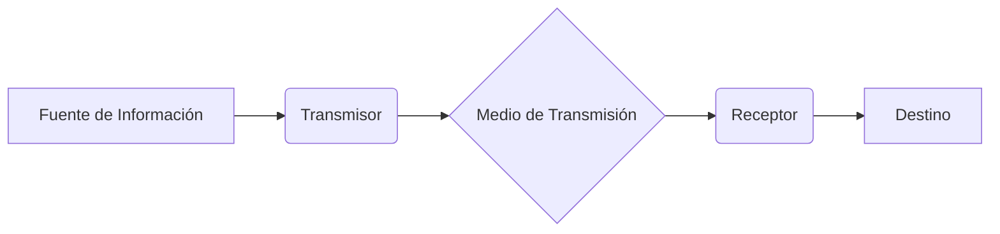

---

# Sistemas de Comunicaciones: Apuntes de Estudio

## 1. Objetivo Fundamental

El propósito principal de un sistema de comunicaciones es, de manera simple, **transferir información de un punto a otro**. Esta información puede ser voz, datos, video, etc. El proceso completo implica la transmisión, recepción y, en muchos casos, el procesamiento de esta información a través de circuitos electrónicos.

## 2. Tipos de Fuentes de Información

La información, en su origen, se presenta en dos formas fundamentales, lo que condiciona el diseño del sistema de comunicaciones.

- **Analógica (Continua):** La señal varía de forma continua en el tiempo y puede tomar un número infinito de valores.
    - *Ejemplos:* Voz humana, música, temperatura medida por un sensor analógico.
- **Digital (Discreta):** La señal toma un número finito de valores (estados) en instantes de tiempo específicos. El caso más común es la señal binaria.
    - *Ejemplos:* Códigos binarios, datos de un ordenador, texto.

## 3. Diagrama en Bloques Simplificado de un Sistema de Comunicaciones

Para entender el flujo de la información, podemos descomponer cualquier sistema en tres bloques fundamentales:

- **Transmisor:** Conjunto de circuitos que procesa la señal de la fuente original para hacerla apta para la transmisión. Las funciones típicas incluyen:
    - **Modulación:** "Montar" la información en una señal de alta frecuencia (portadora).
    - **Amplificación:** Aumentar la potencia de la señal para que pueda llegar lejos.
    - **Codificación (en sistemas digitales):** Para eficiencia y corrección de errores.
- **Medio de Transmisión:** Es el canal físico o no físico por el que viaja la señal desde el transmisor hasta el receptor. Actúa como un "puente" que puede degradar la señal.
    - **Guiados:** La señal se confina a un medio sólido.
        - *Ejemplos:* Par de cobre (corriente eléctrica), cable coaxial, fibra óptica (pulsos de luz).
    - **No Guiados:** La señal se irradia a través de la atmósfera o el espacio libre.
        - *Ejemplos:* Ondas de radio, microondas, enlaces satelitales.
- **Receptor:** Conjunto de circuitos que capta la señal del medio, la procesa y la reconvierte a su forma original (o lo más parecido posible) para entregarla al destino.
    - **Funciones clave:** Sintonización (seleccionar la señal deseada), amplificación de señales débiles y **demodulación** (extraer la información de la portadora).

## 4. El Corazón del Sistema: Modulación y Demodulación

Las señales de información (como la voz, de baja frecuencia) no son eficientes para viajar largas distancias por sí mismas. Aquí es donde entra la modulación.

- **Definición:** Es el proceso de modificar una o más propiedades de una señal de alta frecuencia, llamada **señal portadora** (generalmente una onda senoidal), en proporción a la **señal moduladora** (la información que queremos enviar).
- **Señal Portadora:** Una onda de alta frecuencia, generalmente senoidal, que actúa como un "vehículo" para transportar la información. Se define por: **v(t) = Vc sen (2πfct + θ)** , donde:
    - `Vc`: Amplitud
    - `fc`: Frecuencia
    - `θ`: Fase
- **Modulador:** Circuito en el transmisor que realiza la modulación. Su salida es la **onda modulada**.
- **Demodulación:** El proceso inverso a la modulación. Se realiza en el receptor mediante un **demodulador** para recuperar la señal de información original a partir de la onda modulada recibida.

### 4.1. ¿Por qué es Necesaria la Modulación?

1.  **Radiación Eficiente con Antenas:** Para que una antena irradie energía de manera eficiente, su tamaño debe ser comparable a la longitud de onda (`λ = c/f`) de la señal. Las señales de baja frecuencia (ej. voz a 1 kHz) tienen longitudes de onda enormes (300 km), haciendo imposible construir una antena práctica. La modulación traslada la información a altas frecuencias, donde las longitudes de onda son pequeñas y las antenas factibles.
2.  **Evitar Interferencias y Permitir la Multiplexación:** Todas las señales de información (voz, música) ocupan rangos de frecuencia similares (ej. el espectro de audio). Si se transmitieran directamente, se mezclarían y sería imposible distinguirlas. La modulación asigna a cada transmisor una "porción" exclusiva del espectro, un **canal**, evitando la interferencia. Esto se conoce como multiplexación por división de frecuencia (FDM).

## 5. Clasificación de los Sistemas de Comunicación

Según la naturaleza de la señal de información y la portadora, los sistemas se clasifican en:

- **Sistemas Analógicos:** Tanto la señal de información como la portadora son analógicas (continuas). La modulación varía de forma continua un parámetro de la portadora.
    - *Ejemplos:* Radio AM, Radio FM, Televisión analógica.
- **Sistemas Digitales:** La señal de información es digital (discreta, con valores binarios). La portadora puede ser analógica o digital.
    - *Ejemplos:* Transmisión de datos por Ethernet, Radio digital, Comunicaciones Wi-Fi, Telefonía móvil (4G/5G).

## 6. Técnicas de Modulación Detalladas

La siguiente tabla resume cómo se clasifican las modulaciones según el tipo de señal modulante y el parámetro de la portadora que se modifica.

| Parámetro Modificado | Señal Modulante **Analógica** | Señal Modulante **Digital** |
| :--- | :--- | :--- |
| **Amplitud (V)** | **AM (Amplitud Modulada)** | **ASK (Amplitude Shift Keying)** |
| **Frecuencia (f)** | **FM (Frecuencia Modulada)** | **FSK (Frequency Shift Keying)** |
| **Fase (θ)** | **PM (Fase Modulada)** | **PSK (Phase Shift Keying)** |
| **Amplitud + Fase** | - | **QAM (Quadrature Amplitude Modulation)** |

### 6.1. Modulaciones Analógicas (Concepto)

- **AM (Amplitud Modulada):** La *amplitud* de la portadora de alta frecuencia (RF) se varía siguiendo las variaciones de la amplitud de la señal de información (AF).
    - *Aplicación típica:* Radiodifusión comercial en la banda de 535 kHz a 1705 kHz, con canales de 10 kHz de ancho de banda.
- **FM (Frecuencia Modulada):** La *frecuencia* instantánea de la portadora se varía en proporción a la amplitud de la señal de información. La amplitud de la portadora permanece constante.
    - *Ventaja:* Mucho más inmune al ruido que AM.
    - *Aplicación típica:* Radiodifusión comercial en la banda de 88 MHz a 108 MHz, con canales de 200 kHz de ancho de banda.
- **PM (Fase Modulada):** La *fase* instantánea de la portadora se varía en proporción a la amplitud de la señal de información. Está íntimamente relacionada con la FM.

### 6.2. Modulaciones Digitales (Concepto)

En las modulaciones digitales, la señal de información es un flujo de bits (0s y 1s). La portadora "conmuta" entre dos o más estados posibles.

- **ASK (Amplitude Shift Keying):** La amplitud de la portadora conmuta entre dos niveles. Un bit '1' se representa con la presencia de la portadora a una amplitud constante, y un bit '0' con su ausencia (o una amplitud diferente). Es simple pero sensible al ruido.
- **FSK (Frequency Shift Keying):** La frecuencia de la portadora conmuta entre dos (o más) valores predefinidos. Un bit '1' se asigna a una frecuencia (`f1`) y un bit '0' a otra (`f2`). Es robusta y se usó en los primeros módems.
- **PSK (Phase Shift Keying):** La fase de la portadora conmuta para representar los bits.
    - **BPSK:** La fase cambia 180° para representar un 1 o un 0.
    - **QPSK:** Se usan 4 fases diferentes (ej. 45°, 135°, 225°, 315°) para transmitir 2 bits por cada cambio de fase (símbolo). Es más eficiente.
- **QAM (Quadrature Amplitude Modulation):** Es una modulación híbrida que varía *tanto la amplitud como la fase* de la portadora. Es muy eficiente en el uso del ancho de banda, permitiendo transmitir múltiples bits por símbolo. Se usa en Wi-Fi, TV digital y 4G/5G (ej. 16-QAM, 64-QAM, 256-QAM).

## 7. Conceptos Clave para el Examen

- **Translación de Frecuencia:** El proceso de convertir una señal de una banda de frecuencias a otra. El modulador en el transmisor realiza una **conversión elevadora** (de baja a alta frecuencia), y el demodulador/receptor realiza una **conversión descendente** (de alta a baja frecuencia).
- **Ancho de Banda (Canal):** Es el rango de frecuencias asignado a una transmisión específica. Es un recurso limitado y preciado.
    - *Ejemplo:* Canal de voz telefónica ≈ 3 kHz, Canal de radio AM comercial = 10 kHz, Canal de radio FM comercial = 200 kHz.
- **Espectro Electromagnético:** Es el rango completo de todas las frecuencias posibles de radiación electromagnética. Los sistemas de comunicaciones utilizan diferentes porciones de este espectro (radio, microondas, infrarrojo, luz visible) según sus necesidades y características de propagación.

Este resumen cubre los principios fundamentales. A partir de esta base, podrás profundizar en los análisis matemáticos de cada tipo de modulación, los cálculos de potencia y ancho de banda, y el estudio del ruido en los sistemas de comunicación. ¡Mucho éxito en tu examen!